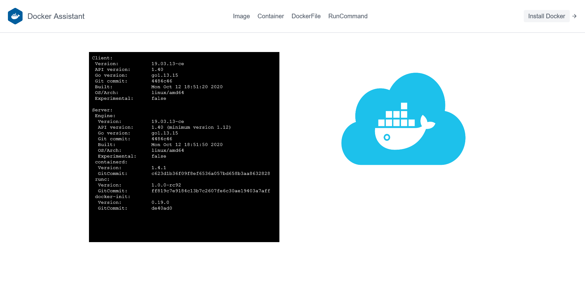
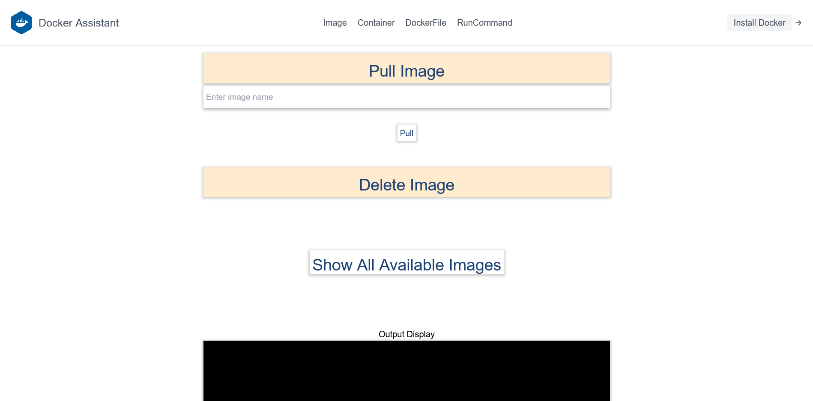
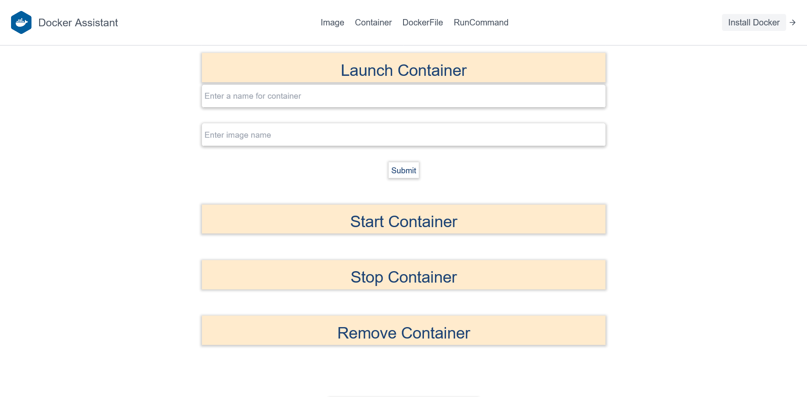
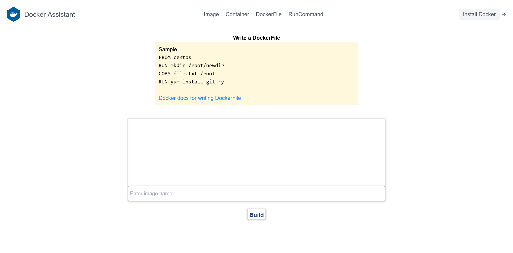
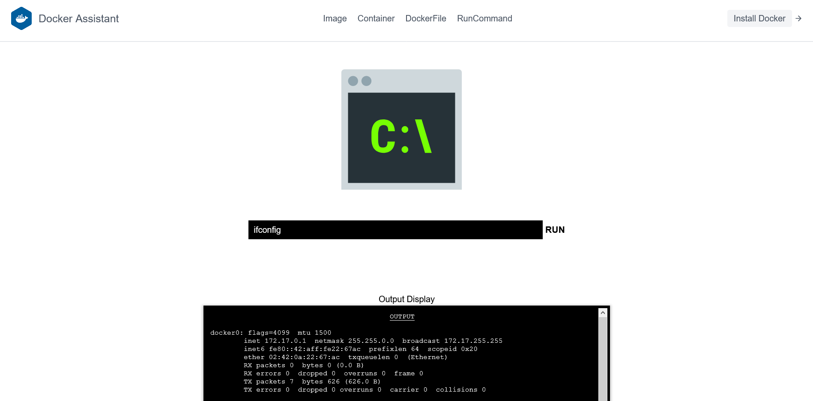

# dockerwebUI
## Creating Web user interface to manage docker - used HTML, CSS, Javascript, Flask and Ansible

Images,

Containers,

Dockerfile

Run commands,

### Watch the video,

https://user-images.githubusercontent.com/64186894/115995006-17384180-a5f7-11eb-8365-38f8147c7625.mp4
